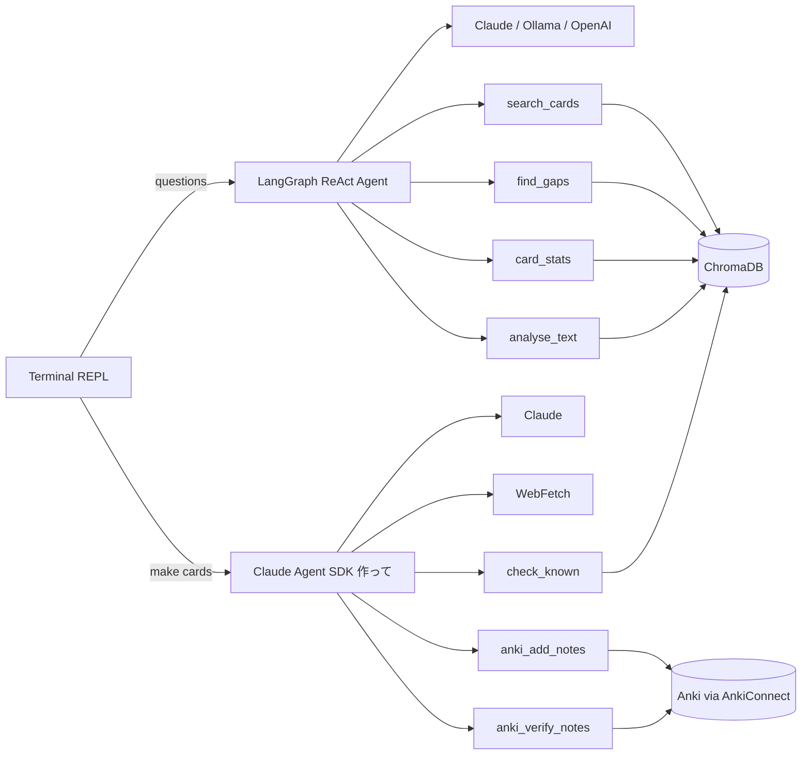

# anki-tomodachi

A RAG-powered Japanese study assistant that turns your Anki deck into a queryable knowledge base. Ask questions about your vocabulary, find grammar gaps, get study stats, and analyse passages — all grounded in what you actually know.

## What it does

- **Word relationships** — "挑戦ってどういう意味？私が知ってる言葉で説明して" — explains words using vocabulary you already have
- **Gap analysis** — "N1の文法で私がまだ知らないものは？" — compares your deck against N1 grammar patterns
- **Study stats** — "最近どの分野が弱い？" — surfaces leeches, weak cards, and distribution
- **Text analysis** — paste Japanese text and see which words you know vs don't
- **Personalised practice** — generates examples using your actual vocabulary

## Prerequisites

- **Node.js** 20+
- **Anki** desktop with [AnkiConnect](https://ankiweb.net/shared/info/2055492159) plugin installed
- **ChromaDB** installed locally (the `chroma` CLI)
- **An LLM** — either an **Anthropic API key** (default) or a local
  [Ollama](https://ollama.com) install (see [Choosing a model](#choosing-a-model))

### Installing ChromaDB

You don't need to start ChromaDB yourself — `npm run chat` and `npm run ingest`
launch it automatically (see [ChromaDB auto-start](#chromadb-auto-start) below).
You just need the `chroma` CLI installed:

```bash
# via pipx (recommended on macOS)
brew install pipx
pipx install chromadb
```

If you'd rather run ChromaDB in Docker instead of natively, start it manually in
its own terminal and the auto-start step will detect and reuse it:

```bash
docker run -p 8000:8000 chromadb/chroma
```

## Setup

```bash
# install dependencies
npm install

# set your API key
cp .env.example .env
# edit .env and add your ANTHROPIC_API_KEY

# ingest your Anki cards (Anki must be running)
npm run ingest

# start chatting
npm run chat
```

## Usage

### Chat

```
npm run chat
```

Opens an interactive REPL. Ask questions in Japanese or English — the agent searches your deck, checks what you know, and gives grounded answers.

```
友達 > 挑戦ってどういう意味？私が知ってる言葉で説明して
  → search_cards({"query":"挑戦"})
  → search_cards({"query":"challenge attempt try"})

デッキを確認しました！

挑戦（ちょうせん）= challenge; attempt

あなたが知ってる言葉で説明すると：
- 「試す」（to try）に近いですが、もっと大きな目標に向かうイメージ
- 「頑張る」（to do one's best）の気持ちで「難しいことに立ち向かう」こと

例：新しいN1の文法に挑戦する
```

Tool calls are shown dimmed so you can see what's being retrieved. Conversation context is maintained across turns.

### Run from anywhere

Install the global `anki-tomodachi` command once:

```bash
npm link   # from the repo root
```

Then from any directory:

```bash
anki-tomodachi          # start chatting (same as npm run chat)
anki-tomodachi ingest   # re-sync cards from Anki (same as npm run ingest)
anki-tomodachi db       # start ChromaDB and keep it running (same as npm run db)
```

ChromaDB data, logs, and your `.env` are always resolved against the repo, no
matter where you invoke it from.

> **nvm note:** `npm link` installs into the active Node version's bin
> directory. If you switch Node versions with nvm, re-run `npm link` under the
> new version.

### Choosing a model

anki-tomodachi can run on cloud or local LLMs. At chat startup you get a picker
listing the current Claude models (Fable 5, Opus 4.8, Sonnet 5, Sonnet 4.6,
Haiku 4.5) plus any models installed in a local [Ollama](https://ollama.com) —
pick a number or hit enter for the default. You can also type a custom
`provider/name` spec. Supported providers:

| Provider    | Example spec                | Notes                                                                          |
| ----------- | --------------------------- | ------------------------------------------------------------------------------ |
| `anthropic` | `anthropic/claude-sonnet-5` | Default. Needs `ANTHROPIC_API_KEY`.                                            |
| `ollama`    | `ollama/qwen3:8b`           | Fully local, no API key. Needs Ollama running.                                 |
| `openai`    | `openai/gpt-4o`             | Needs `OPENAI_API_KEY` (or set `base_url` for any OpenAI-compatible endpoint). |

Set a default without the picker via `TOMODACHI_MODEL` in `.env`:

```bash
TOMODACHI_MODEL=ollama/qwen3:8b
```

With a local model and the built-in local embeddings (multilingual-e5-small),
the whole assistant runs **offline**.

> **Tool calling required.** The agent works by calling tools (`search_cards`,
> etc.), so a local model must support tool/function calling. `qwen3` and
> `qwen2.5` work well; some models (e.g. `llama3.1`) tend to loop and hit the
> agent's recursion limit. If answers come back without any `→ search_cards(...)`
> lines, the model likely can't call tools — switch to a qwen-family model.

### 作って — generate cards

Paste an article URL (or Japanese text) and ask for cards. The agent reads the
source, picks sentences worth learning from, checks each candidate word against
your deck, drafts cards in your house format, and **waits for your approval
before writing anything to Anki**.

```
友達 > https://www3.nhk.or.jp/news/html/... 知らない単語をカードにして
  → WebFetch({"url":"https://www3.nhk.or.jp/news/html/..."})
  → check_known({"words":["拙速","拮抗","懸案","踏み込む","相次ぐ"]})

3枚作ったよ。

1. 拙速
   専門家からは、拙速な決定が現場に混乱をもたらしたという指摘が相次いでいる
   ・⏩❌ rushing something and botching it

2. 拮抗
   賛否は拮抗している
   ・⚖️ evenly matched

3. 懸案
   長年の懸案に踏み込んだ点を評価する声もある
   ・ずっと解決されないまま残っている問題

飛ばしたやつ：政府（固有名詞っぽい）、専門家・指摘・評価（もうデッキにある）

これでいい？

友達 > 1と3だけお願い
  → anki_add_notes({"cards":[...]})
  → anki_verify_notes({"noteIds":[1785484869662,1785484885534]})

2枚追加しました！
```

Cards are written to your **Japanese Vocabulary** deck using the **Japanese**
note type:

| Field        | Content                                                                     |
| ------------ | --------------------------------------------------------------------------- |
| `Expression` | The source sentence, target word highlighted amber (the card front)         |
| `Meaning`    | `単語：` then a `・` line — emoji, a Japanese gloss, or English             |
| `Reading`    | The whole sentence in furigana notation: ` 拙速[せっそく]な 決定[けってい]` |

The HTML is rendered by the app, not the model, so every card comes out in the
same format. After writing, the agent reads the notes back out of Anki and
checks each field — if something doesn't match, it tells you rather than
claiming success.

You can also start explicitly with `/tsukutte <url or text>`.

**Guardrails**

- Never writes to Anki without an explicit approval turn
- Never cards a word already in your deck (checked against ChromaDB first)
- Has no shell and no filesystem access — only its five card tools plus web fetch
- Caps each run at 5 cards, and tells you what it skipped and why
- Pre-flight-checks Anki is reachable before doing any drafting work

Run `/ingest` afterwards so the new cards are searchable next session.

### Slash commands

| Command     | Description                                   |
| ----------- | --------------------------------------------- |
| `/stats`    | Show deck card count                          |
| `/ingest`   | Re-import cards from Anki                     |
| `/tsukutte` | Make cards from a URL or pasted Japanese text |
| `/help`     | List commands                                 |
| `/quit`     | Exit (alias `/exit`)                          |

### Ingestion

```
npm run ingest
```

Pulls all cards from Anki via AnkiConnect, strips HTML, extracts metadata (ease, interval, lapses), and embeds them into ChromaDB. Run this once initially, then again whenever you want to sync changes from Anki.

### ChromaDB auto-start

Both `npm run chat` and `npm run ingest` run `scripts/start-chroma.sh` first,
which ensures a local ChromaDB server is up on `localhost:8000`:

- If a server is **already running**, it's detected and reused (no duplicate is started).
- Otherwise `chroma run --path <repo>/chroma_data` is launched in the background,
  logging to the repo's `chroma.log`, and the script waits until it's ready before
  continuing.

The server's lifetime follows your session: if chat (or ingest) started it, it
is **stopped automatically when you exit** — no idle RAM use, and the ~1s
startup is paid on the next launch. A server that was already running (started
with `anki-tomodachi db`, Docker, or another session) is detected, reused, and
left running when you exit. Your data persists to the repo's `chroma_data/`
either way, and the server binds to `localhost` only.

```bash
npm run db   # start ChromaDB and leave it running (keep it warm)

pkill -f "chroma run"   # stop a lingering server manually
```

## Architecture

Two engines sit behind one REPL. You never pick between them — the CLI routes
on intent.



- **ChromaDB** stores card embeddings with metadata (deck, tags, ease, interval, lapses, card type)
- **AnkiConnect** pulls cards during ingestion, and writes new cards during 作って
- **LangGraph** orchestrates the read-only ReAct agent that answers questions
- **The Claude Agent SDK** runs the card-generation agent, with the shared tool
  core exposed as an in-process MCP server
- **The LLM** (Anthropic Claude, a local Ollama model, or any OpenAI-compatible
  endpoint) answers questions; card generation always runs on Claude

### Why two engines

The chat path is read-only, provider-agnostic, and answers in one turn — a ReAct
loop over four retrieval tools is exactly the right size for it, and LangGraph
keeps it working against Ollama and OpenAI as well as Claude.

Card generation is a different shape of problem: it writes to a real deck, so it
needs a hard tool boundary (no shell, no filesystem), a genuine
propose→approve→write→verify cycle, and web fetching. The Claude Agent SDK gives
those directly — `tools: []` to start from zero built-ins, `allowedTools` to
pre-approve exactly five in-process MCP tools, and session resume so the
approval is a real conversation turn rather than a bolted-on y/n prompt.

Both engines share the same tool logic via `src/tools-core.ts`, so a deck query
means the same thing on either path.

## Tech stack

TypeScript, Node.js (ESM), LangGraph.js, LangChain.js, Claude Agent SDK, ChromaDB, Anthropic Claude / Ollama / OpenAI, Zod, Vitest

## Project structure

```
src/
  anki-connect.ts   # Typed AnkiConnect HTTP client (read)
  anki-write.ts     # Card rendering, note creation, read-back verification
  types.ts          # Zod schemas for cards, metadata, search results
  vectorstore.ts    # ChromaDB client, search, bulk retrieval
  embeddings.ts     # Local multilingual-e5-small embedding function
  ingest.ts         # Card ingestion pipeline
  tools-core.ts     # Shared tool logic used by both agents
  tools.ts          # LangGraph tool bindings (search, gaps, stats, analyse)
  model.ts          # LLM factory + model selection (Anthropic / Ollama / OpenAI)
  agent.ts          # LangGraph ReAct agent setup (chat)
  agent-tsukutte.ts # Claude Agent SDK agent + MCP tools (作って card generation)
  prompts.ts        # System prompts for both agents
  banner.ts         # Startup banner
  cli.ts            # Interactive REPL with streaming + model picker
scripts/
  ingest.ts         # CLI entry point for ingestion
  start-chroma.sh   # Idempotently starts/reuses the local ChromaDB server
bin/
  anki-tomodachi    # Global launcher (installed via npm link)
data/
  n1_grammar.json   # N1 grammar reference list for gap analysis
```
