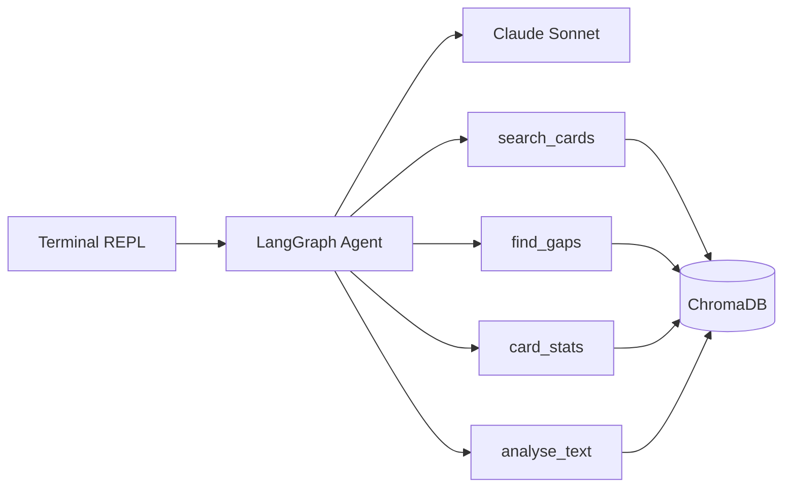

# anki-tomodachi

A RAG-powered Japanese study assistant that turns your Anki deck into a queryable knowledge base. Ask questions about your vocabulary, find grammar gaps, get study stats, and analyse passages — all grounded in what you actually know.

## What it does

- **Word relationships** — "挑戦ってどういう意味？私が知ってる言葉で説明して" — explains words using vocabulary you already have
- **Gap analysis** — "N1の文法で私がまだ知らないものは？" — compares your deck against N1 grammar patterns
- **Study stats** — "最近どの分野が弱い？" — surfaces leeches, weak cards, and distribution
- **Text analysis** — paste Japanese text and see which words you know vs don't
- **Personalised practice** — generates examples using your actual vocabulary

## Prerequisites

- **Node.js** 20+
- **Anki** desktop with [AnkiConnect](https://ankiweb.net/shared/info/2055492159) plugin installed
- **ChromaDB** server running locally
- **Anthropic API key**

### Starting ChromaDB

```bash
# via pipx (recommended on macOS)
brew install pipx
pipx install chromadb
chroma run --path ./chroma_data

# or via Docker
docker run -p 8000:8000 chromadb/chroma
```

## Setup

```bash
# install dependencies
npm install

# set your API key
cp .env.example .env
# edit .env and add your ANTHROPIC_API_KEY

# ingest your Anki cards (Anki must be running)
npm run ingest

# start chatting
npm run chat
```

## Usage

### Chat

```
npm run chat
```

Opens an interactive REPL. Ask questions in Japanese or English — the agent searches your deck, checks what you know, and gives grounded answers.

```
友達 > 挑戦ってどういう意味？私が知ってる言葉で説明して
  → search_cards({"query":"挑戦"})
  → search_cards({"query":"challenge attempt try"})

デッキを確認しました！

挑戦（ちょうせん）= challenge; attempt

あなたが知ってる言葉で説明すると：
- 「試す」（to try）に近いですが、もっと大きな目標に向かうイメージ
- 「頑張る」（to do one's best）の気持ちで「難しいことに立ち向かう」こと

例：新しいN1の文法に挑戦する
```

Tool calls are shown dimmed so you can see what's being retrieved. Conversation context is maintained across turns.

### Slash commands

| Command   | Description               |
| --------- | ------------------------- |
| `/stats`  | Show deck card count      |
| `/ingest` | Re-import cards from Anki |
| `/help`   | List commands             |
| `/quit`   | Exit                      |

### Ingestion

```
npm run ingest
```

Pulls all cards from Anki via AnkiConnect, strips HTML, extracts metadata (ease, interval, lapses), and embeds them into ChromaDB. Run this once initially, then again whenever you want to sync changes from Anki.

## Architecture



- **ChromaDB** stores card embeddings with metadata (deck, tags, ease, interval, lapses, card type)
- **AnkiConnect** pulls cards from your running Anki instance (only needed during ingestion)
- **LangGraph** orchestrates a ReAct agent that picks the right tool for each question
- **Claude Sonnet** reasons about your cards and generates personalised answers

## Tech stack

TypeScript, Node.js (ESM), LangGraph.js, LangChain.js, ChromaDB, Anthropic Claude, Zod, Vitest

## Project structure

```
src/
  anki-connect.ts   # Typed AnkiConnect HTTP client
  types.ts          # Zod schemas for cards, metadata, search results
  vectorstore.ts    # ChromaDB client, search, bulk retrieval
  ingest.ts         # Card ingestion pipeline
  tools.ts          # LangGraph tool definitions (search, gaps, stats, analyse)
  agent.ts          # LangGraph ReAct agent setup
  prompts.ts        # System prompt
  cli.ts            # Interactive REPL with streaming
scripts/
  ingest.ts         # CLI entry point for ingestion
data/
  n1_grammar.json   # N1 grammar reference list for gap analysis
```
